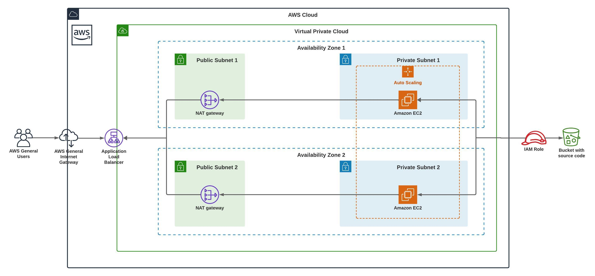

## Udacity Cloud DevOps Engineer: High availability web app using CloudFormation
## CD12352 - Infrastructure as Code Project Solution - Iván Urra

## Infrastructure Diagram



## Spin up instructions
### Variables
In the udagram.yml file, update the ImageId (ami) and InstanceType variables with your desired values, and replace the S3 bucket address with its corresponding value.

### Creating Network Stack
```
cd udacity-project-deploy-a-high-availability-web-app-using-cloudformation
./create.sh udagram-network network.yml network-parameters.json
```

### Creating Server Stack
```
cd udacity-project-deploy-a-high-availability-web-app-using-cloudformation
./create.sh udagram-servers udagram.yml udagram-parameters.json
```

## Tear down instructions
### Delete Network Stack
```
cd udacity-project-deploy-a-high-availability-web-app-using-cloudformation
./delete.sh udagram-network network.yml network-parameters.json
```

### Delete Server Stack
```
cd udacity-project-deploy-a-high-availability-web-app-using-cloudformation
./delete.sh udagram-servers udagram.yml udagram-parameters.json
```

## Other considerations
- Access public url for web application from Application Load Balancer: 
http://udagra-webap-xwdxcivpk7sx-898036819.us-east-1.elb.amazonaws.com/


